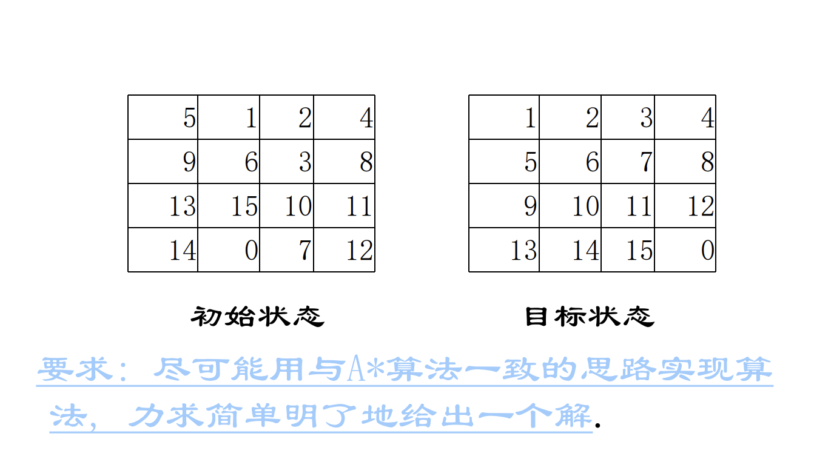
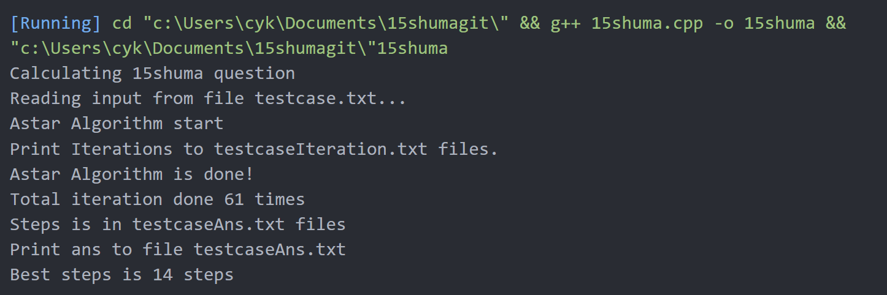

# 15数码

## 问题描述

        $15$数码问题指的是，在一个$4*4$的矩阵中，每个方格中有一个$0-15$不重复的数字，其中$0$代表着这个位置为空。在这个矩阵中，$0$可以与四周位置的数字交换位置。

        $15$数码问题，就是需要在这个矩阵中找到一个方案，使得现有的矩阵变换为另一个目标矩阵。



## 算法设计

### 宽度优先算法

        直接的思路是可以利用宽度优先算法来对$15$数码问题进行搜索，寻找到当前矩阵中$0$的位置，然后将$0$与四个方向上的数字进行交换，判断一下这个新状态是否有出现过，如果没有出现过便加入队列，如果出现过，说明已经有过更优的方案可以到达这个状态了。直到目标状态出现，就可以找到最优的方案了。

伪代码如下：

```c++
node bfs(node start){
    queue<node> nodes;
    nodes.push(start);
    while(!nodes.empty()){
        cur = nodes.front();
        point p = findZero(cur);
        for(int i=0;i<4;i++){
            nextnode = swapCurZero(cur,i);
            if(isSame(nextnode)==0){
                return nextnode;
            }
            if(findViolation(nextnode)==false){
                nodes.push(nextnode);
            }   
        }
    }    
}
```

        $nodes$是存储搜索节点的队列，$swapCurZero()$是根据参数i，将0的位置与上下左右方向的数字进行交换，$isSame()$用于判断当前状态是否和目标状态一致，如果一致则说明已经找到了最佳路径，则返回当前节点，返回值是与目标矩阵不一致的数量。$findViolation()$用于寻找交换后的状态是否有出现过，如果新状态没出现过则加入队列中。

### 启发式搜索算法

        宽度优先算法显而易见的问题就是计算量太大了，对于一个$4*4$的矩阵来说，有$15!$种不同的组合。宽度优先算法的每一次迭代都会扩展出$4$种情况，算法复杂度是$O(4^n)$，指数级别的算法复杂度太大了，这里我们可以考虑借助$A$星算法对宽度优先算法进行优化。

        $A$星算法的核心思想是利用所处理问题的启发信息引导搜索。

        我们设估价函数：

        $F(n) = d(n) + W(n)$

        其中取$d(n)$为搜索深度，$W(n)$为矩阵中不在位的个数。

        $F(n)$即可表示当前状态到达目标状态的希望程度。我们将每一个节点对其估计值进行排序，优先对希望程度高的节点进行搜索，即可极可能快的找到一个到达目标函数的方案。

        其中节点数据可以利用最小堆来存储，确保每次搜索的都是估计值最小的节点，本程序使用的是$STL$中的优先队列。判断状态重复本程序使用的是$STL$中的集合。

        $A$星算法在宽度优先算法的基础上修改就可以得到。

        伪代码如下：

```c++
node astar(node start){
    priority_queue<node> nodes;
    nodes.push(start);
    while(!nodes.empty()){
        cur = nodes.front();
        point p = findZero(cur);
        for(int i=0;i<4;i++){
            nextnode = swapCurZero(cur,i);
            nextnode.value = nextnode.depth + isSame(nextnode);
            if(isSame(nextnode)==0){
                return nextnode;
            }
            if(findViolation(nextnode)==false){
                nodes.push(nextnode);
            }   
        }
    }    
}
```

## 效率分析

### 宽度优先算法

        宽度优先算法每一次运算会扩展出$4$个节点，对于$n$次迭代来说，算法复杂度为$O(4^n)$。

        我们以这组样例来进行实验

        初始矩阵：

```
5 1 2 4
9 6 3 8
13 15 10 11
14 0 7 12
```

        目标矩阵：

```c++
1 2 3 4
5 6 7 8
9 10 11 12
13 14 15 0
```

        宽度优先算法需要大约$2e8$次迭代才可以算出正确结果。

### A星算法

        A星算法虽然同样会运算会扩展出4个节点，对于n次迭代来说，算法复杂度为O(4^n)，但因为估价函数的存在，大量不好的节点都没有进行扩展和迭代，同样是宽度优先算法的数据，这次的程序仅仅只迭代了61次就算出了结果。

        输出结果如下



```
Step #0:
5    1    2    4    
9    6    3    8    
13    15    10    11    
14    0    7    12    

Step #1:
5    1    2    4    
9    6    3    8    
13    0    10    11    
14    15    7    12    

Step #2:
5    1    2    4    
9    6    3    8    
13    10    0    11    
14    15    7    12    

Step #3:
5    1    2    4    
9    6    3    8    
13    10    7    11    
14    15    0    12    

Step #4:
5    1    2    4    
9    6    3    8    
13    10    7    11    
14    0    15    12    

Step #5:
5    1    2    4    
9    6    3    8    
13    10    7    11    
0    14    15    12    

Step #6:
5    1    2    4    
9    6    3    8    
0    10    7    11    
13    14    15    12    

Step #7:
5    1    2    4    
0    6    3    8    
9    10    7    11    
13    14    15    12    

Step #8:
0    1    2    4    
5    6    3    8    
9    10    7    11    
13    14    15    12    

Step #9:
1    0    2    4    
5    6    3    8    
9    10    7    11    
13    14    15    12    

Step #10:
1    2    0    4    
5    6    3    8    
9    10    7    11    
13    14    15    12    

Step #11:
1    2    3    4    
5    6    0    8    
9    10    7    11    
13    14    15    12    

Step #12:
1    2    3    4    
5    6    7    8    
9    10    0    11    
13    14    15    12    

Step #13:
1    2    3    4    
5    6    7    8    
9    10    11    0    
13    14    15    12    

Step #14:
1    2    3    4    
5    6    7    8    
9    10    11    12    
13    14    15    0    
```

## 核心代码实现

```C++
#include <fstream>
#include <iostream>
#include <queue>
#include <set>
#include <string>
using namespace std;
ifstream in("test\\testcase.txt");//输入
ofstream out("test\\testcaseIeteration.txt");
ofstream outans("test\\testcaseAns.txt");
int target[4][4] = {
    {1, 2, 3, 4},
    {5, 6, 7, 8},
    {9, 10, 11, 12},
    {13, 14, 15, 0},
};
struct node {
  int state[4][4];
  int depth;
  int value;
  node *parent;
  bool operator<(const node a) const { return this->value > a.value; }
};
int evaluate(node a) {
  int cnt = 0;
  for (int i = 0; i < 4; i++) {
    for (int j = 0; j < 4; j++) {
      cnt += a.state[i][j] != target[i][j];
    }
  }
  return cnt;
}
string toString(node a) {
  string str;
  for (int i = 0; i < 4; i++) {
    for (int j = 0; j < 4; j++) {
      str += a.state[i][j] + '0';
    }
  }
  return str;
}
node *AstarSearch(node *start) {
  cout << "Astar Algorithm start" << endl;
  cout << "Print Iterations to testcaseIteration.txt files." << endl;

  priority_queue<node> nodes;
  nodes.push(*start);
  set<string> maps;
  maps.insert(toString(*start));

  node *curnode;
  node *nextnode;

  string str;
  int vary;
  bool flag = false;
  int cnt = 0;

  if (evaluate(*start) != 0) {
    while (!nodes.empty()) {
      curnode = new node;
      *curnode = nodes.top();
      nodes.pop();

      out << "Iteration #" << ++cnt << ":" << endl;
      out << "Search Depth #" << curnode->depth << endl;
      out << "Evaluation Value :" << curnode->value << endl;
      for (int i = 0; i < 4; i++) {
        for (int j = 0; j < 4; j++) {
          out << curnode->state[i][j] << ' ';
        }
        out << endl;
      }
      out << endl;

      if (cnt % 100000 == 0) {
        cout << "Calculating Iteration " << cnt << " times...." << endl;
      }

      for (int i = 0; i < 4; i++) {
        for (int j = 0; j < 4; j++) {
          if (curnode->state[i][j] == 0) {
            if (j > 0) {
              nextnode = new node;
              *nextnode = *curnode;
              nextnode->depth++;
              nextnode->parent = curnode;
              nextnode->state[i][j] ^= nextnode->state[i][j - 1];
              nextnode->state[i][j - 1] ^= nextnode->state[i][j];
              nextnode->state[i][j] ^= nextnode->state[i][j - 1];
              str = toString(*nextnode);
              if (maps.find(str) == maps.end()) {
                maps.insert(str);
                vary = evaluate(*nextnode);
                if (vary == 0) {
                  flag = true;
                  break;
                } else {
                  nextnode->value = nextnode->depth + vary;
                  nodes.push(*nextnode);
                }
              }
            }

            if (i > 0) {
              nextnode = new node;
              *nextnode = *curnode;
              nextnode->depth++;
              nextnode->parent = curnode;
              nextnode->state[i][j] ^= nextnode->state[i - 1][j];
              nextnode->state[i - 1][j] ^= nextnode->state[i][j];
              nextnode->state[i][j] ^= nextnode->state[i - 1][j];
              str = toString(*nextnode);
              if (maps.find(str) == maps.end()) {
                maps.insert(str);
                vary = evaluate(*nextnode);
                if (vary == 0) {
                  flag = true;
                  break;
                } else {
                  nextnode->value = nextnode->depth + vary;
                  nodes.push(*nextnode);
                }
              }
            }

            if (i < 3) {
              nextnode = new node;
              *nextnode = *curnode;
              nextnode->depth++;
              nextnode->parent = curnode;
              nextnode->state[i][j] ^= nextnode->state[i + 1][j];
              nextnode->state[i + 1][j] ^= nextnode->state[i][j];
              nextnode->state[i][j] ^= nextnode->state[i + 1][j];
              str = toString(*nextnode);
              if (maps.find(str) == maps.end()) {
                maps.insert(str);
                vary = evaluate(*nextnode);
                if (vary == 0) {
                  flag = true;
                  break;
                } else {
                  nextnode->value = nextnode->depth + vary;
                  nodes.push(*nextnode);
                }
              }
            }

            if (j < 3) {
              nextnode = new node;
              *nextnode = *curnode;
              nextnode->depth++;
              nextnode->parent = curnode;
              nextnode->state[i][j] ^= nextnode->state[i][j + 1];
              nextnode->state[i][j + 1] ^= nextnode->state[i][j];
              nextnode->state[i][j] ^= nextnode->state[i][j + 1];
              str = toString(*nextnode);
              if (maps.find(str) == maps.end()) {
                maps.insert(str);
                vary = evaluate(*nextnode);
                if (vary == 0) {
                  flag = true;
                  break;
                } else {
                  nextnode->value = nextnode->depth + vary;
                  nodes.push(*nextnode);
                }
              }
            }
          }
        }
      }

      if (flag) {
        break;
      }
    }
  } else {
    nextnode = curnode;
  }
  out << "Iteration #" << ++cnt << ":" << endl;
  out << "Search Depth #" << nextnode->depth << endl;
  out << "Evaluation Value :" << nextnode->value << endl;
  for (int i = 0; i < 4; i++) {
    for (int j = 0; j < 4; j++) {
      out << nextnode->state[i][j] << ' ';
    }
    out << endl;
  }
  out << endl;

  std::cout << "Astar Algorithm is done!" << endl;
  std::cout << "Total iteration done " << cnt << " times" << endl;
  std::cout << "Steps is in testcaseAns.txt files" << endl;

  return nextnode;
}
void printans(node *s) {
  if (s == NULL) {
    return;
  }
  printans(s->parent);

  outans << "Step #" << s->depth << ":" << endl;
  for (int i = 0; i < 4; i++) {
    for (int j = 0; j < 4; j++) {
      outans << s->state[i][j] << '\t';
    }
    outans << endl;
  }
  outans << endl;

  return;
}
int main() {
  std::cout << "Calculating 15shuma question\n";
  std::cout << "Reading input from file testcase.txt..." << endl;
  node *start = new node;
  node *ans;

  for (int i = 0; i < 4; i++) {
    for (int j = 0; j < 4; j++) {
      in >> start->state[i][j];
    }
  }
  start->depth = 0;
  start->value = evaluate(*start) + start->depth;
  start->parent = NULL;
  ans = AstarSearch(start);

  cout << "Print ans to file testcaseAns.txt" << endl;
  printans(ans);

  std::cout << "Best steps is " << ans->depth << " steps" << endl;

  return 0;
}
```
